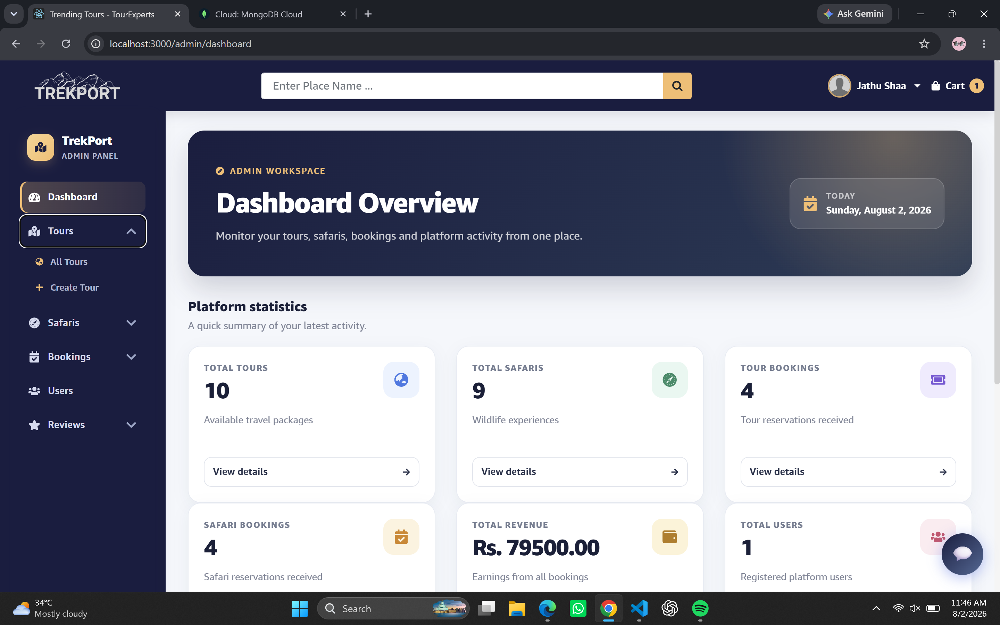
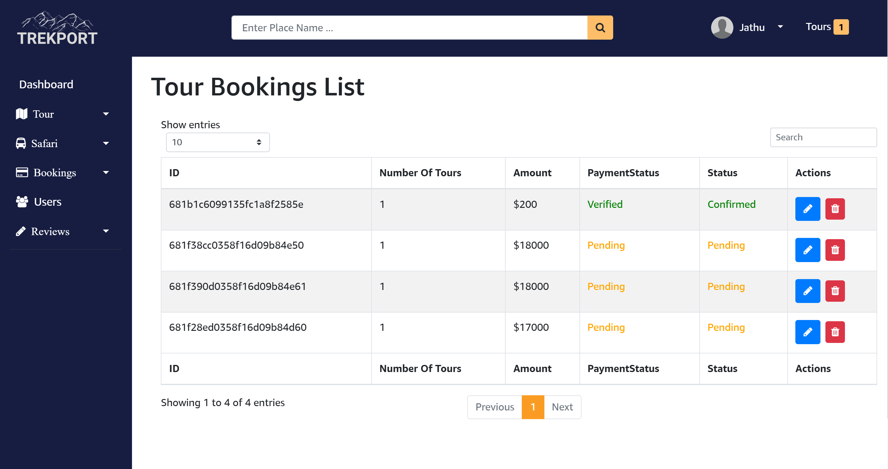
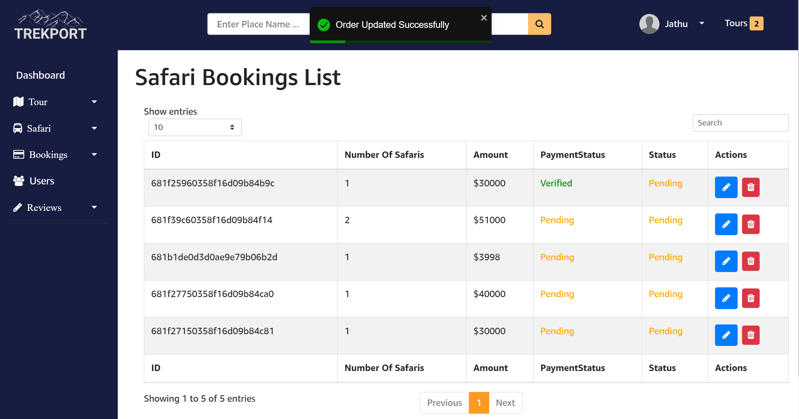
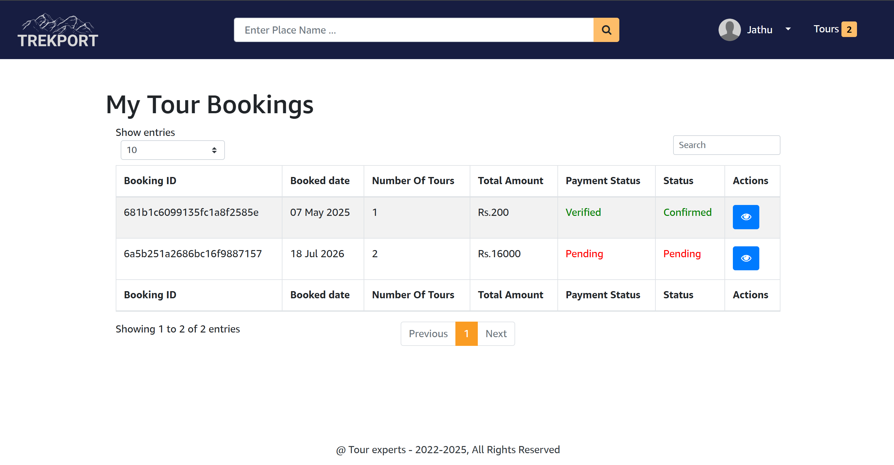

# 🌍 TrekPort - Travel Management System

A full-stack travel management application built with the MERN stack that enables users to explore tour packages, make bookings, manage reservations, and download invoices through an intuitive web interface.

## 🛠️ Tech Stack

- ⚛️ React.js
- 🟢 Node.js
- 🚂 Express.js
- 🍃 MongoDB
- 🎨 Tailwind CSS

## ✨ Features

- User authentication and authorization
- Tour and safari package management
- Complete CRUD operations for packages
- Online tour and safari booking
- Booking validation and management
- Admin dashboard for managing tours and safaris
- Payment verification and booking status updates
- Invoice generation and download
- User booking history
- Review and rating system
- Responsive user interface

## 📸 Screenshots

### 🏠 Home Page

### 👨‍💼 Admin Dashboard

### ➕ Add New Tour (Admin)

.png)

### 🗺️ Tour Details

### 🚍 Tour Bookings

### 🦁 Safari Bookings

### 📋 My Bookings

