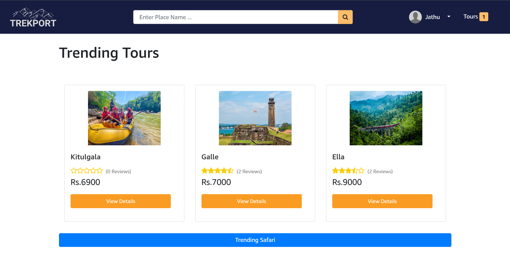
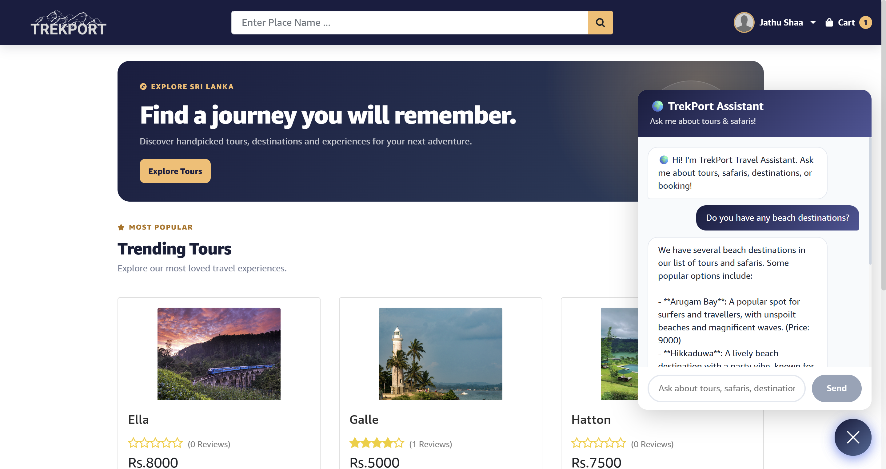
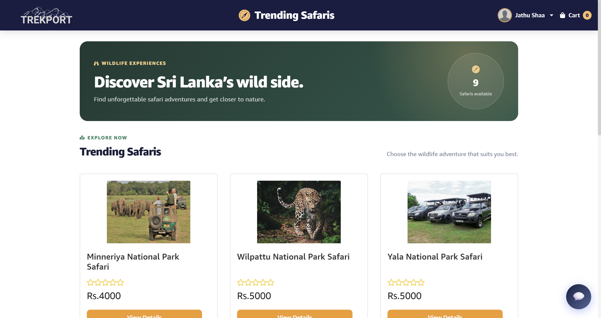
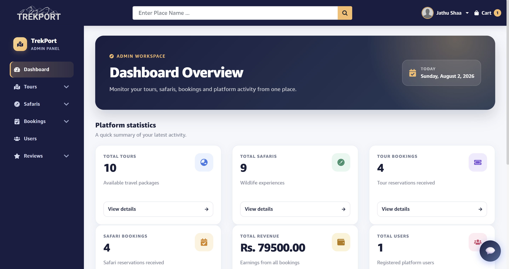
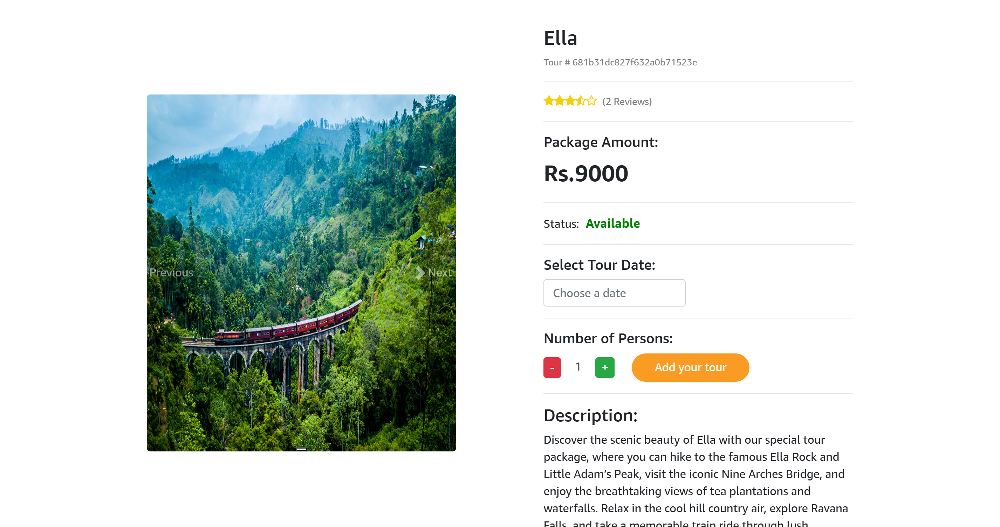
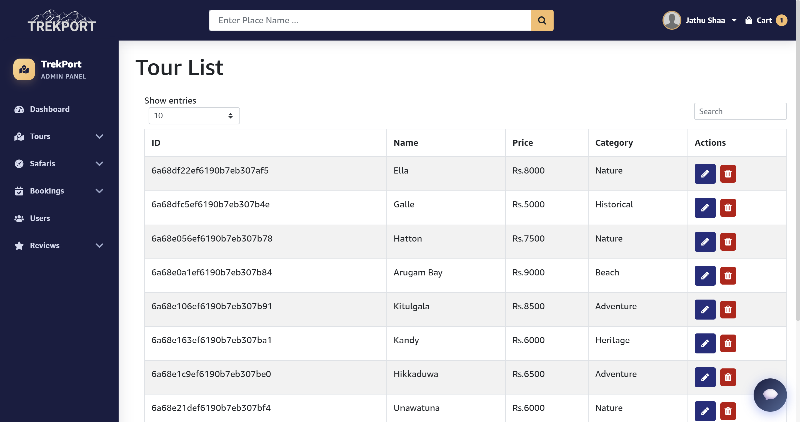
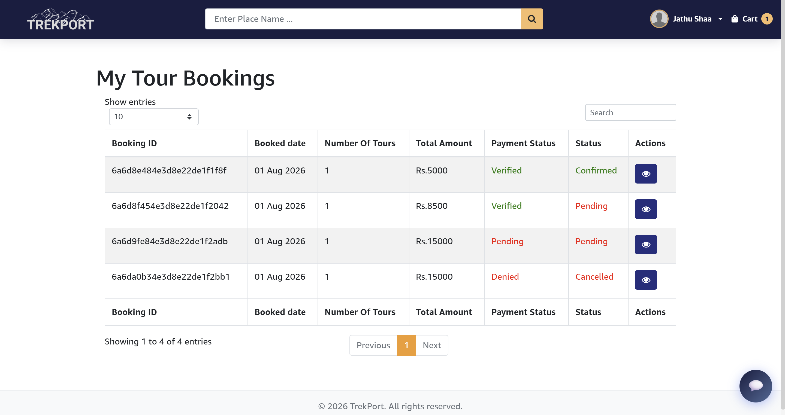

# 🌍 TrekPort - Travel Management System

A full-stack travel management application built with the MERN stack, allowing users to explore tour and safari packages, make bookings, manage reservations, download invoices, and receive real-time travel assistance through an AI-powered chatbot.

## 🛠️ Tech Stack

- ⚛️ React.js
- 🎨 Tailwind CSS
- 🟢 Node.js
- 🚂 Express.js
- 🍃 MongoDB
- 🤖 Groq API (LLaMA 3.1)
- 🔐 JWT Authentication

## ✨ Features

### 👤 User Features

- User authentication and authorization
- Browse tour and safari packages
- View detailed package information
- Online tour and safari booking
- Booking history and management
- Invoice generation and download
- Review and rating system

### 👨‍💼 Admin Features

- Admin dashboard
- Tour management (CRUD)
- Safari package management (CRUD)
- Booking verification
- Booking status updates
- Package validation and management

### 🤖 AI Travel Assistant

- Real-time AI-powered travel assistance
- Tour and safari package recommendations
- Booking guidance and support
- Travel tips and destination information
- Instant responses using Groq LLaMA 3.1

### ⚡ Additional Features

- Payment verification
- Responsive user interface
- Secure REST API integration

## 📸 Screenshots

### 🏠 Home Page

### 🤖 AI Travel Assistant

### 🦁 Safari Packages

### 👨‍💼 Admin Dashboard

### ➕ Add New Tour

.png)

### 🗺️ Tour Details

### 📋 Tour Management

### 🚍 Safari Bookings

.png)

### 📝 User Bookings

